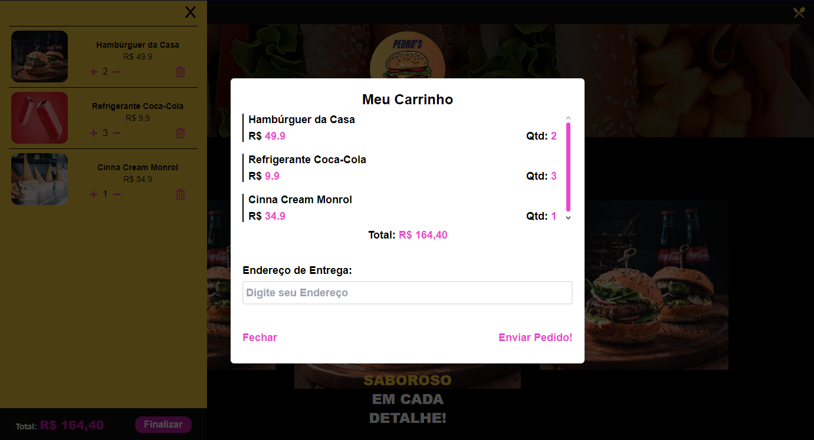

# Dev Burguer
- Uma Landing Page no formato de uma simples e-commerce de uma hamburgueria fictícia.

# Objetivo
- Usar da boa prática no códio tsx e na sua estilização com tailwindocss. 
- Objetivo principal, seria fazer uma landing page, de uma hamburgueria fictícia, onde ao selecionar items, eles serão inseridos ao carrinho e dele ser redirecionado para o watsapp, onde finalizaria o pedido!

## Tecnologias
- HTML
- CSS
- TypeScript

## Bibliotecas
- React
- Tailwind
- Swiper
- Zustand
- Sonner
- Vitest
- Testing Library

## API
- WhatsApp

# Utilização das Bibliotecas
- Desenvolvi toda a estrutura base em tsx.
- Sua estilização feita 99.9% em TaiwindoCSS, Trazendo praticidade para a responsividade, onde é mais simples e de fácil manutenção. Até porque, com essa tecnologia utilizamos do método mobile first.
- A partir da base completa fui para os estudos de como criar um carrinho, sem tanta lógica e código em excesso com apenas JS puro ou com a biblioteca Redux. 
    - Assim encontrei o Zustand, e a partir de aulas e vídeos no Youtube, além de sua documentação, desenvolvi a lógica de carrinho com ele.
- Para uma melhor visibilidade, encontrei a biblioteca sonner, que nos trás pop-ups de diferentes tipos. 
    - Nesse projeto utilizei do tipo success, warning e error.
- Por fim, para mandar os produtos do carrinho, seu total e o endereço inserido, ultilizei da api gratuita do WhatsApp.
    - Onde seto o número que receberá a mensagem, e passo todos os dados pegos.
## Visual Final

